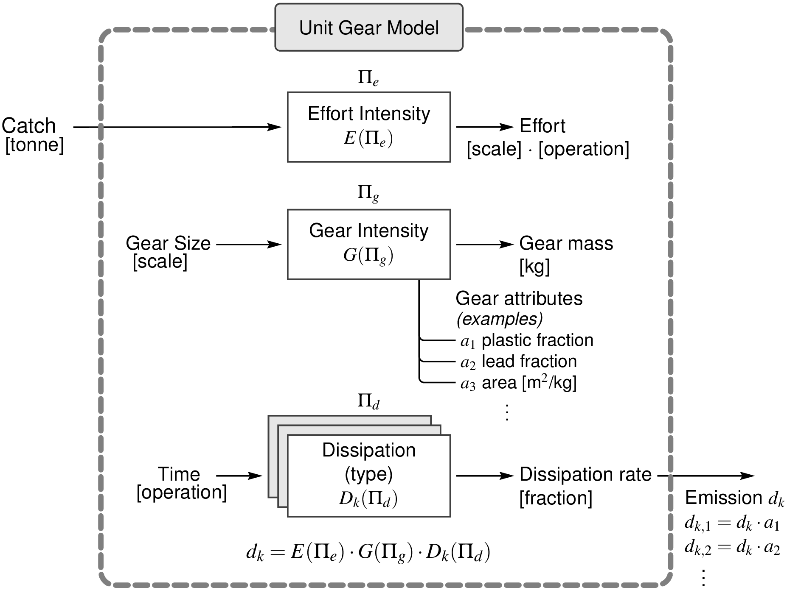

# unit_gears
Unit Fishing Gears intensity model and library for industrial ecology research.

## Unit Gear Model

Schematic diagram of the unit gear model as three distinct stages that each transform an input variable to an output variable. The dimensions of each variable are reported in square brackets.

## Included Data Sources

Library models are included in the `models` directory of the repository.  Each `json` file is read for the following fields:

 * `source_` Every field starting with this string is added to a source documentation string
 * `effort_models` list of effort intensity models
 * `gear_models` list of gear intensity models
 * `dissipation_models` list of dissipation models

| Filename | Contents |
|----|----|
|Akyol 2012.json| Turkey; driftnets; Albacore|
|Avadi 2014.json| Peru; purse seine; Anchoveta|
|Deshpande 2020.json| Norway; dissipation for 6 gear types|
|Gabr 2012.json|Egypt; pelagic longline; Albacore|
|Gilman 2020-pre.json| Global; dissipation estimates revised from Richardson et al (2019)|
|Grimaldo 2019.json|Norway; set gillnets; cod|
|Hoffman 2009.json|USA; Trawl gear intensity; Atlantic Croaker and White Perch|
|Laissane 2011.json|Mozambique; small-scale purse seine; sardine, anchovy|
|Laso 2017.json|Spain; purse seine; European anchovy|
|LCI Model.json|Generic "trivial" effort-model for LCI-based gear studies|
|Pravin 2016.json|India; purse seine gear intensity|
|Sala 2019.json|Mediterranean; trawl gear intensity meta-analysis|
|Soldo 2019.json|Croatia; purse seine; anchovy|
|Thrane 2006.json|Denmark; Gear intensity by fuel economy; trawl and Danish seine|
|Watanabe 2016.json|Japan; small-scale trawl|
